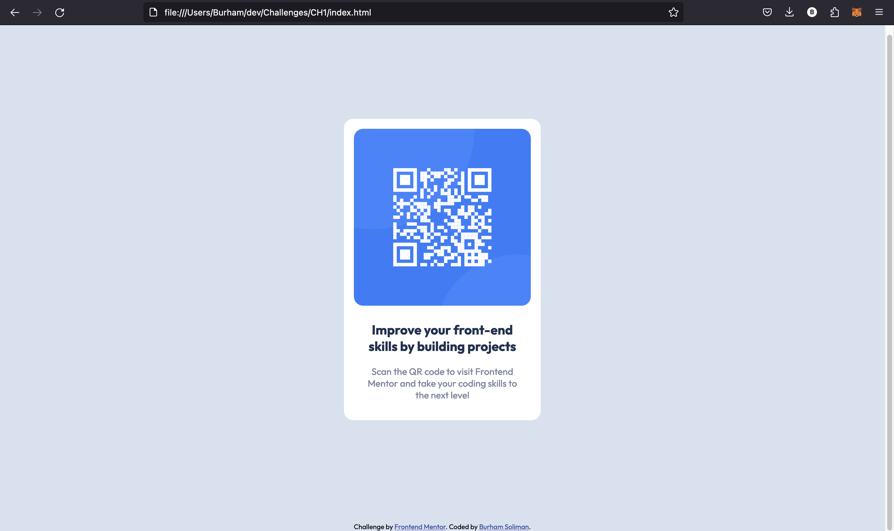

# Frontend Mentor - QR code component solution

This is a solution to the [QR code component challenge on Frontend Mentor](https://www.frontendmentor.io/challenges/qr-code-component-iux_sIO_H). Frontend Mentor challenges help you improve your coding skills by building realistic projects. 

## Table of contents

- [Overview](#overview)
  - [Screenshot](#screenshot)
  - [Links](#links)
- [My process](#my-process)
  - [Built with](#built-with)
  - [What I learned](#what-i-learned)
  - [Continued development](#continued-development)
  - [Useful resources](#useful-resources)
- [Author](#author)
- [Acknowledgments](#acknowledgments)

## Overview

### Screenshot

### Links

- Solution URL: [Add solution URL here](https://github.com/egstar/QRCode)
- Live Site URL: [Add live site URL here](https://egstar.github.io/QRCode)

## My process

### Built with

- Semantic HTML5 markup
- CSS custom properties
- Flexbox

### What I learned

Already knows all of this properties

### Continued development

None

### Useful resources

None

## Author

- Website - [Burham Soliman](https://www.burhams.com)
- Frontend Mentor - [@egstar](https://www.frontendmentor.io/profile/egstar)
- Twitter - [@yourusername](https://www.twitter.com/bori0o)

## Acknowledgments

None

